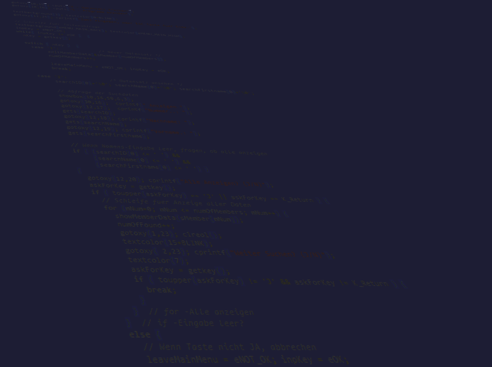

<!-- $theme: gaia -->
<!-- template: invert -->



# `Clean Code(r)`


### *vom Frickeln zum Entwickeln*

#### Part I

###### by
#### [3DH](https://github.com/3dh-de/)


---
<!-- page_number: true -->
<!-- footer: https://github.com/3dh-de/ -->


# Features

- Motivation
- Goto Clean Code - von `int 21h` zu `print()`
- Wasserfall & Spaghetti Code - *EDO VK*
- Workshop: *(Re)design *EDO VK**
- Pragmatisch: *Use Cases + OOD + OOP*
- Methodisch: *Models, Patterns, Duties*
- Ausblick: *Part II - Automation, Agile, Tickets...*

---


# How to write slides?

Split slides by horizontal ruler `---`. It's very simple.

```md
# Slide 1

foobar

---

# Slide 2

foobar
```

> *Notice: Ruler (`<hr>`) is not displayed in Marp.*

---


# Directives

Marp's Markdown has extended directives to affect slides.

Insert HTML comment as below:
```html
<!-- {directive_name}: {value} -->
```

```html
<!--
{first_directive_name}:  {value}
{second_directive_name}: {value}
...
-->
```
---


## Global Directives

### `$theme`

Changes the theme of all the slides in the deck. You can also change from `View -> Theme` menu.

```
<!-- $theme: gaia -->
```

|Theme name|Value|Directive|
|:-:|:-:|:-|
|***Default***|default|`<!-- $theme: default -->`
|**Gaia**|gaia|`<!-- $theme: gaia -->`


---


### `$width` / `$height`

Changes width and height of all the slides.

You can use units: `px` (default), `cm`, `mm`, `in`, `pt`, and `pc`.

```html
<!-- $width: 12in -->
```

### `$size`

Changes slide size by presets.

Presets: `4:3`, `16:9`, `A0`-`A8`, `B0`-`B8` and suffix of `-portrait`.

```html
<!-- $size: 16:9 -->
```

<!--
$size: a4

Example is here. Global Directive is enabled in anywhere.
It apply the latest value if you write multiple same Global Directives.
-->

---


## Page Directives

The page directive would apply to the  **current page and the following pages**.
You should insert it *at the top* to apply it to all slides.

### `page_number`

Set `true` to show page number on slides. *See lower right!*

```html
<!-- page_number: true -->
```

<!--
page_number: true

Example is here. Pagination starts from this page.
If you use multi-line comment, directives should write to each new lines.
-->

---


### `template`

Set to use template of theme.

The `template` directive just enables that using theme supports templates.

```html
<!--
$theme: gaia
template: invert
-->

Example: Set "invert" template of Gaia theme.
```

---


### `footer`

Add a footer to the current slide and all of the following slides

```html
<!-- footer: This is a footer -->
```

Example: Adds "This is a footer" in the bottom of each slide

---

### `prerender`

Pre-renders a slide, which can prevent issues with very large background images.

```html
<!-- prerender: true -->
```

---

## Pro Tips

#### Apply page directive to current slide only

Page directive can be selectively applied to the current slide by prefixing the page directive with `*`.

```
<!-- *page_number: false -->
<!-- *template: gaia -->
```

<!--
*page_number: false

Example is here.
Page number is not shown in current page, but it's shown on later pages.
-->

---

#### Slide background Images

You can set an image as a slide background.


---

#### Maths Typesetting

Mathematics is typeset using the `KaTeX` package. Use `$` for inline maths, such as $ax^2+bc+c$, and `$$` for block maths:

$$I_{xx}=\int\int_Ry^2f(x,y)\cdot{}dydx$$

```html
This is inline: $ax^2+bx+c$, and this is block:

$$I_{xx}=\int\int_Ry^2f(x,y)\cdot{}dydx$$

```

---

## Enjoy writing slides! :+1:

### https://github.com/yhatt/marp

Copyright &copy; 2016 [Yuki Hattori](https://github.com/yhatt)
This software released under the [MIT License](https://github.com/yhatt/marp/blob/master/LICENSE).
