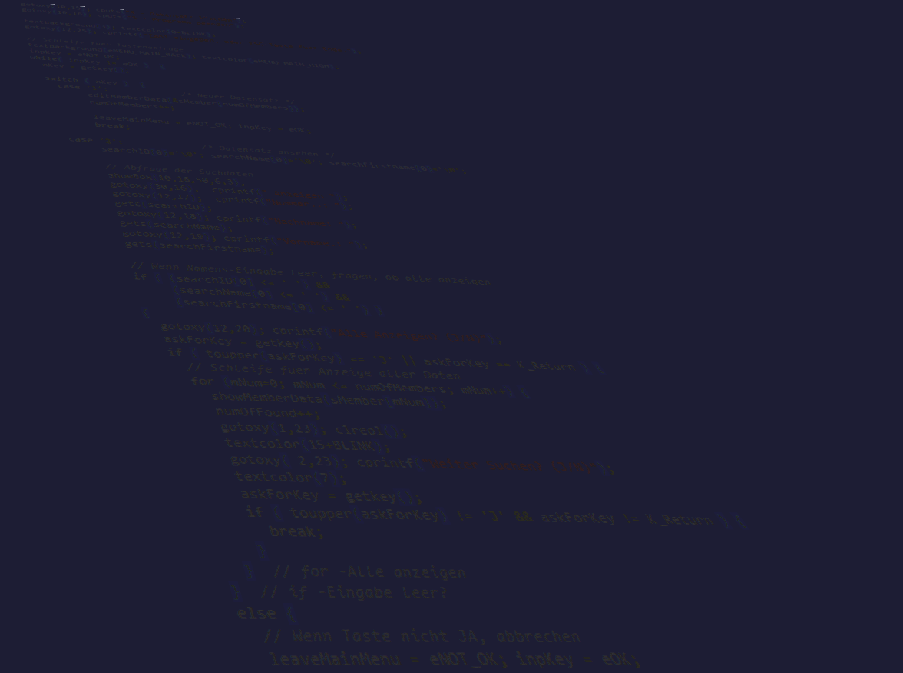

<!-- $theme: gaia -->
<!-- template: invert -->



# `Clean Code(r)`


### *vom Frickeln zum Entwickeln*

#### Part I

###### by
#### [3DH](https://github.com/3dh-de/)


---
<!-- page_number: true -->
<!-- footer: https://github.com/3dh-de/ -->


# Agenda

- Motivation
- Diagnose: **Frickler** - *bin ich auch betroffen?*
- Goto Clean Code - von `int 21h` zu `print()`
- Wasserfall & Spaghetti Code - *Anti-Patterns*
- Workshop: 
  *Finde die Fehler - Anti-Patterns in Beispielen*
- Pragmatisch Programmieren
- Clean Code Developer
- Ausblick: *Part II - Automation, Agile, Tickets...*

---


# Motivation

- History: `1991` Basic+Asm .. `1999` C++ .. `200x` Agile ..
- Probleme:
  * fehlendes (Technologie/Methoden-)Wissen
  * Ungeduld, wenig Erfahrung
  * hohe Ansprüche & Motivation
  * wachsende Komplexität:  
    *QBasic/Perl/SH Scripts --> modulare C++ Apps*

---


# Diagnose: **Frickler**

- Checkliste: *ab 2 Treffern Diagnose* `Frickelitis`
  * ich arbeite doch nur alleine (an meinem Code)
  * meinen Code verstehe nur ich
  * ich verwende gern Code-Snippets (Copy & Paste)
  * ich progge lieber, als zu lesen (Try & Error)
  * ich liebe simplen Code (viele Klassen == doof)
  * ich schmeisse nix weg, lieber auskommentieren
  * Doku? Wozu - der Code ist doch kommentiert!

---


# Diagnose: **Frickler**

- Checkliste: *ab 2 Treffern Diagnose* `Entwickler`
  * ich arbeite (auch) in Teams (an meinem Code)
  * mein Code ist selbsterklärend (sprechende Namen)
  * ich refaktorisiere lieber, statt zu kopieren
  * ich belese mich / arbeite mich lieber (in neue 
    APIs/Tools/Sprachen) ein, statt auszuprobieren
  * ich liebe gut strukturierten Code (OOP)
  * ich dokumentiere meine Klassen+Methoden

---


# Goto Clean Code
###### von `int 21h` zu `print()`

- **Ziele**
  * Programmiersprache & Tools beherrschen
  * Lesbaren Code schaffen
  * Methodisch vorgehen / effizienter arbeiten
  * Wiederverwendbarkeit & Qualität steigern
  * sich selbst stetig weiterentwickeln
 
---


# Goto Clean Code
###### von `int 21h` zu `print()`


- **Lesen & Lernen** statt **Try & Error**
  * Der Pragmatische Programmierer²
  * Clean Code², [CCD Initiative](http://clean-code-developer.de/)
    
  * Der Termin², Projekt-Automatisierung²
  * Ship It!², Fachmagazine & Foren ...
- **Austausch** mit anderen Entwicklern
- OSS **Projekte**, Raspi ...

---


# Wasserfall & Spaghetti Code


- **Wasserfall**-Modell [[Wikipedia](https://de.wikipedia.org/wiki/Wasserfallmodell)]
- **Anti-Patterns**  [[Wikipedia](https://de.wikipedia.org/wiki/Anti-Pattern)]
  * Regeln für schlechten Code
  * liefern Lösungsansätze anhand häufiger Fehler bei:
    * Projektmanagement
    * Architektur & Entwurf
    * Programmierung
    * Organisation/Team

---


# Wasserfall & Spaghetti Code

- **Anti-Patterns**
  * Gottklasse / God object 
    == *die kann alles, aber nix (fachliches) richtig* 
  * Spaghetti Code 
    == *gut durchrühren (mit `goto`) für max. Verwirrung*
  * Copy and Paste 
    == *Wie man zum Code-Messi wird*
  * Zwiebel 
    == *Code erweitern, bis der Arzt kommt*

---


# Wasserfall & Spaghetti Code

- **Anti-Patterns**
  * Lavafluss
    == ..
  * ...

---


# Workshop: 
### Finde die Fehler - Anti-Patterns in Beispielen

- **EDO VK** - C/C++ Kassensystem
  `edo-main.cpp` und `edo-main.h`
- **

---


## Page Directives

The page directive would apply to the  **current page and the following pages**.
You should insert it *at the top* to apply it to all slides.

### `page_number`

Set `true` to show page number on slides. *See lower right!*

```html
<!-- page_number: true -->
```

<!--
page_number: true

Example is here. Pagination starts from this page.
If you use multi-line comment, directives should write to each new lines.
-->

---


### `template`

Set to use template of theme.

The `template` directive just enables that using theme supports templates.

```html
<!--
$theme: gaia
template: invert
-->

Example: Set "invert" template of Gaia theme.
```

---


### `footer`

Add a footer to the current slide and all of the following slides

```html
<!-- footer: This is a footer -->
```

Example: Adds "This is a footer" in the bottom of each slide

---

### `prerender`

Pre-renders a slide, which can prevent issues with very large background images.

```html
<!-- prerender: true -->
```

---

## Pro Tips

#### Apply page directive to current slide only

Page directive can be selectively applied to the current slide by prefixing the page directive with `*`.

```
<!-- *page_number: false -->
<!-- *template: gaia -->
```

<!--
*page_number: false

Example is here.
Page number is not shown in current page, but it's shown on later pages.
-->

---

#### Slide background Images

You can set an image as a slide background.


---

#### Maths Typesetting

Mathematics is typeset using the `KaTeX` package. Use `$` for inline maths, such as $ax^2+bc+c$, and `$$` for block maths:

$$I_{xx}=\int\int_Ry^2f(x,y)\cdot{}dydx$$

```html
This is inline: $ax^2+bx+c$, and this is block:

$$I_{xx}=\int\int_Ry^2f(x,y)\cdot{}dydx$$

```

---

## Enjoy writing slides! :+1:

### https://github.com/yhatt/marp

Copyright &copy; 2016 [Yuki Hattori](https://github.com/yhatt)
This software released under the [MIT License](https://github.com/yhatt/marp/blob/master/LICENSE).
